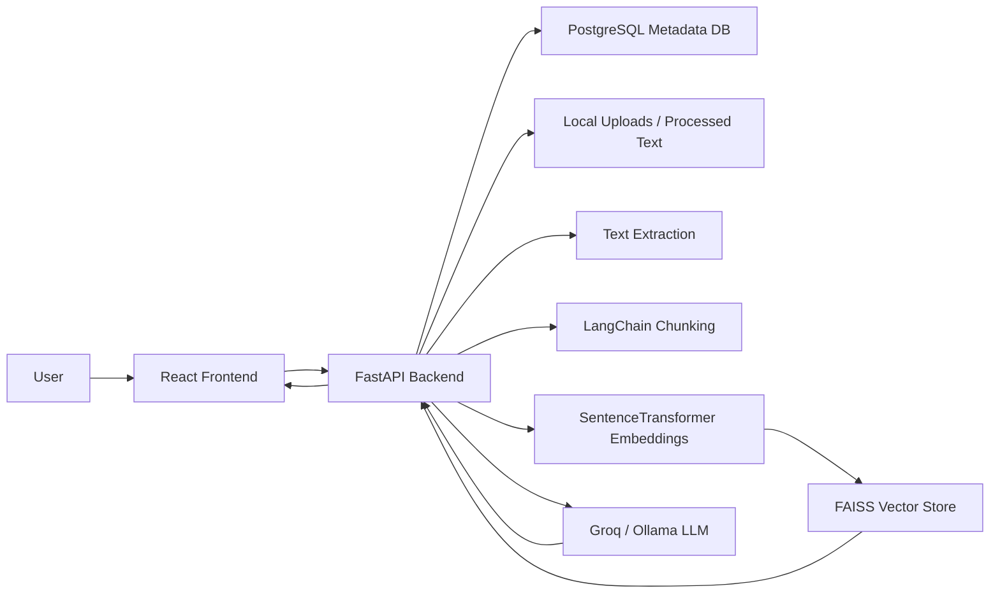
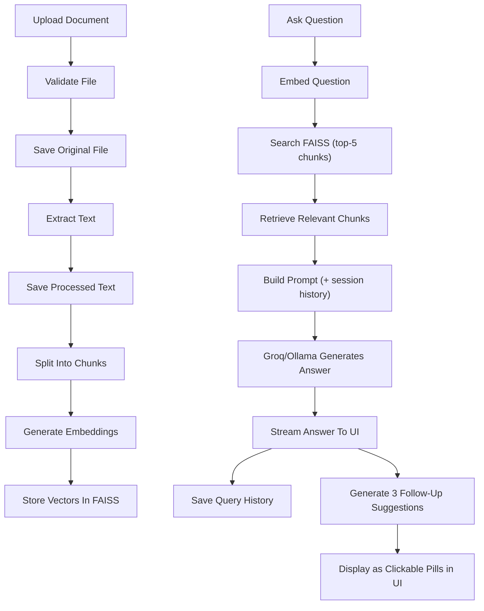

# 📄 DocuMind AI

**DocuMind AI** is a full-stack **RAG (Retrieval-Augmented Generation)** document assistant. Upload documents, ask questions in natural language, and get streaming, document-grounded answers powered by semantic search and LLMs — with multi-turn conversation memory and smart follow-up suggestions.

> Upload → Extract → Chunk → Embed → Retrieve → Generate → Stream → Suggest


---

## Table of Contents

- [Overview](#overview)
- [Features](#features)
- [Tech Stack](#tech-stack)
- [Architecture](#architecture)
- [RAG Pipeline](#rag-pipeline)
- [Backend Responsibilities](#backend-responsibilities)
- [Frontend Responsibilities](#frontend-responsibilities)
- [Important Project Behavior](#important-project-behavior)
- [Getting Started](#getting-started)
  - [Environment Variables](#environment-variables)
  - [Run Locally](#run-locally)
  - [Run With Docker](#run-with-docker)
- [Using an LLM Provider](#using-an-llm-provider)
  - [Groq](#use-groq)
  - [Ollama](#use-ollama)
- [API Reference](#api-reference)
- [License](#license)

---

## Overview

DocuMind AI lets users upload documents in multiple formats, automatically extracts and chunks their text, generates vector embeddings, and stores them in a FAISS index for fast semantic retrieval. When a user asks a question, the app retrieves the most relevant chunks and passes them — along with the full session conversation history — to an LLM (Groq or a local Ollama model) to generate a grounded, streamed answer. After each answer, the app asynchronously generates 3 smart follow-up questions as clickable suggestions, enabling a natural, guided conversation flow.

## Features

- 📂 Multi-format document upload: **PDF, DOCX, TXT, Markdown, HTML**
- ✅ File validation (extension and size checks)
- 📝 Text extraction with processed text storage
- ✂️ LangChain recursive text chunking
- 🧠 HuggingFace SentenceTransformer embeddings
- 🔍 FAISS semantic vector search with configurable top-k retrieval
- 💬 RAG-based, document-grounded answer generation
- ⚡ Streaming answers via SSE-style `fetch` streaming (~0.4s time-to-first-token on Groq)
- 🔀 Multi-provider LLM support: **Groq** and **Ollama**
- 🗣️ **Multi-turn conversation memory** — full session chat history injected into every LLM request
- ✨ **Smart Follow-Up Suggestions** — 3 clickable follow-up questions generated asynchronously after each answer
- 🎯 Selected-document chat (scope Q&A to a specific document)
- 🕓 Query history
- 📊 Analytics dashboard
- 🗑️ Document deletion
- 🔁 Manual and startup FAISS index rebuild
- 👀 Processed text preview
- 🔔 Notifications
- 🐳 Dockerfiles + Docker Compose
- 🐘 PostgreSQL metadata storage via SQLAlchemy
- ⚛️ React frontend with Tailwind CSS, Zustand, and Axios

## Tech Stack

| Layer | Technologies |
|---|---|
| **Frontend** | React, Vite, Tailwind CSS, Zustand, Axios, Lucide Icons |
| **Backend** | Python, FastAPI, SQLAlchemy, Pydantic Settings |
| **AI / RAG** | LangChain, SentenceTransformers, FAISS, Groq, Ollama |
| **Database** | PostgreSQL (commonly a Supabase PostgreSQL pooler URL) |
| **DevOps** | Docker, Docker Compose, GitHub, Render/Vercel-ready setup |

## Architecture



## RAG Pipeline



## Backend Responsibilities

FastAPI handles document upload, validation, extraction, chunking, embedding, FAISS indexing, RAG answering with multi-turn session history, streaming responses, smart follow-up question generation via `/query/follow-ups`, query history, analytics, document deletion, processed text preview, and database communication.

## Frontend Responsibilities

React handles the dashboard, document list, upload UI, selected-document chat, streaming chat output with session history tracking, smart follow-up suggestion pills (clickable to auto-submit), query history, analytics, processed text preview, notifications, delete confirmation, and rebuild-index controls.

## Important Project Behavior

- PostgreSQL stores structured records such as documents, query history, and analytics metadata.
- Original uploaded files and processed text are stored locally.
- The FAISS index lives in memory.
- On backend startup, the app can rebuild the FAISS index from processed text.
- Streaming answers are served from `/query/ask-stream`.
- **Session chat history** is maintained in React state and sent with every request — it is not persisted to the database.
- **Follow-up suggestions** are generated by a separate background call to `/query/follow-ups` after the stream completes.
- The active LLM provider is selected via the backend `.env` file.

---

## Getting Started

### Environment Variables

Create a `backend/.env` file:

```env
DATABASE_URL=your_postgresql_pooler_url

LLM_PROVIDER=groq
GROQ_API_KEY=your_groq_key
GROQ_MODEL_NAME=allam-2-7b

OLLAMA_BASE_URL=http://localhost:11434
OLLAMA_MODEL=llama3.1

APP_NAME=DocuMind AI
API_PREFIX=/api/v1
MAX_FILE_SIZE_MB=20
CHUNK_SIZE=1000
CHUNK_OVERLAP=200
```

> **Using Docker with a local Ollama instance?** Point to the host machine instead of `localhost`:
> ```env
> OLLAMA_BASE_URL=http://host.docker.internal:11434
> ```

### Run Locally

**Backend**

```bash
cd backend

# Windows
.\.venv\Scripts\activate

# macOS / Linux
source .venv/bin/activate

pip install -r requirements.txt
uvicorn app.main:app --reload
```

Backend runs at:

- API: `http://127.0.0.1:8000`
- Interactive docs: `http://127.0.0.1:8000/docs`

**Frontend**

```bash
cd frontend
npm install
npm run dev
```

Frontend runs at:

- `http://localhost:5173`

### Run With Docker

From the project root:

```bash
docker compose up --build
```

Then open:

| Service | URL |
|---|---|
| Frontend | `http://localhost:5174` |
| Backend docs | `http://localhost:8000/docs` |

---

## Using an LLM Provider

### Use Groq

In `backend/.env`:

```env
LLM_PROVIDER=groq
GROQ_API_KEY=your_groq_key
```

Restart the backend.

### Use Ollama

Install [Ollama](https://ollama.com), then pull a model and start the server:

```bash
ollama pull llama3.1
ollama serve
```

In `backend/.env`:

```env
LLM_PROVIDER=ollama
OLLAMA_BASE_URL=http://localhost:11434
OLLAMA_MODEL=llama3.1
```

Restart the backend.

---

## API Reference

All endpoints are prefixed with `API_PREFIX` (default: `/api/v1`).

| Method | Endpoint | Description |
|---|---|---|
| `GET` | `/system/health` | Health check |
| `GET` | `/system/rag-status` | Status of the RAG pipeline / FAISS index |
| `GET` | `/documents` | List all uploaded documents |
| `POST` | `/documents/upload` | Upload a new document |
| `DELETE` | `/documents/{document_id}` | Delete a document |
| `POST` | `/documents/rebuild-index` | Manually rebuild the FAISS index |
| `POST` | `/query/ask` | Ask a question (non-streaming) |
| `POST` | `/query/ask-stream` | Ask a question (streaming, with session history) |
| `POST` | `/query/follow-ups` | Generate 3 follow-up question suggestions from an answer |
| `GET` | `/query/history` | Retrieve query history |
| `GET` | `/analytics/stats` | Retrieve usage analytics |

Full interactive documentation is available at `/docs` (Swagger UI) once the backend is running.

---

## License

This project is available under the [MIT License](LICENSE). Feel free to use, modify, and build on it.

---

<p align="center">Built with FastAPI, React, LangChain, FAISS, and a lot of curiosity about RAG pipelines.</p>